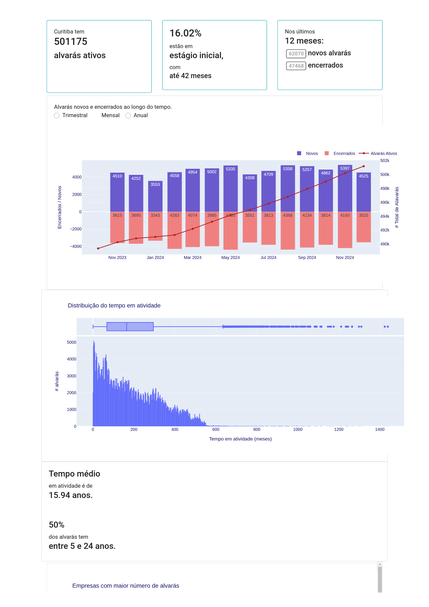
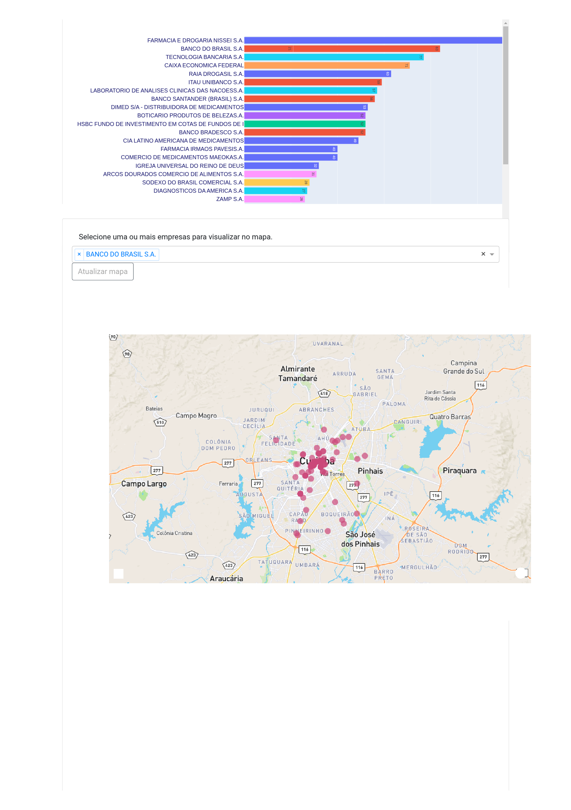

# README #

Uma tentativa de libertar os dados abertos da base de alvarás de Curitiba...

## Dados ##

A origem da informação é a base disponibilizada pela Prefeitura Municipal de Curitiba, acessado por meio do Portal de [Dados Abertos de Curitiba](https://www.curitiba.pr.gov.br/dadosabertos/busca/). O Portal de Dados Abertos de Curitiba e o órgão ou entidade de onde foram acessados os dados não garantem sua autenticidade, qualidade, integridade e atualidade após terem sido disponibilizados para uso secundário.

[Dicionários de dados (original)](http://dadosabertos.c3sl.ufpr.br/curitiba/BaseAlvaras/Alvaras-Dicionario_de_Dados.csv)

|||
|------|:---|
|__ALVARAS DASH__ |uma aplicação com algumas visualizações dinâmicas do dataset de alvarás (Python, Dash, flask, Redis). |
|__Dataset__ | *dataset* criado a partir da Base de Alvarás publicada pela Prefeitura Municipal de Curitiba acessado através do Portal de Dados Abertos. |
|__Wrangling__ | conjunto de scripts que tratam os dados históricos da Base de Alvarás disponíveis no Portal de Dados Abertos e geram o *dataset* consolidado. |
|||

#### Licença
A licença do código é [LGPL3](https://www.gnu.org/licenses/lgpl-3.0.en.html) e dos dados convertidos [Creative Commons Attribution ShareAlike](https://creativecommons.org/licenses/by-sa/4.0/). Cite as fontes * -Fonte: Dados da [Base de Alvaras de Curitiba](https://www.curitiba.pr.gov.br/dadosabertos/busca/), transformados conforme descrito [neste projeto](https://bitbucket.org/sidegoals/alvaras/)*. Caso compartilhe os dados, utilize a mesma licença.

#### Dataset

O arquivo final consolida e agrupa os arquivos da base histórica, e inclui algumas colunas adicionais conforme abaixo. Além das colunas originais descritas no [Dicionários de dados (original)](http://dadosabertos.c3sl.ufpr.br/curitiba/BaseAlvaras/Alvaras-Dicionario_de_Dados.csv).

|||
|---|---|
|Campo (novo) | Descrição dos campos adicionados ao dataset |
|*REFERENCIA_min*| Data da primeira ocorrência nas extrações;|
|*REFERENCIA_max*| última ocorrência nas extrações mensais. Se REFERENCIA_max == "data da última extração", significa que está ainda ativo |
|ATIVO| bool - apenas simplifica as consultas; True se REFERENCIA_max == "data da última extração", caso contrário False |
|*point*| Localização geográfica do endereço (tupla). Além dos campos *address* e *location* |
|*TEMPO_ATIVIDADE*| Tempo de atividade em meses, considera a diferença da data de início da atividade (*INICIO_ATIVIDADE*) e a data em que o alavará deixou de estar ativo (*REFERENCIA_max*)  |

### Alvarás Dashboard 

A aplicação (dash) pode ser encontrada na pasta alvaras/alvarasdash.
Para rodar é necessário um serviço Redis. O docker-compose.yml inicia o redis e a aplicação: `docker compose build && docker compose up` 

É necessário prover um [token do Mapbox](https://account.mapbox.com/access-tokens/). Crie um arquivo .mapbox.token na pasta alvaradash/src com o token (apenas o token). 

#### Screenshot
[View Dashboard Screenshot](https://github.com/marstival/alvaracwb/blob/ff797544dcd21308ab16f2bc306104e91a030f1a/Dash%20screenshot.pdf)

